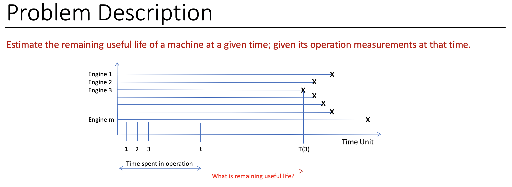
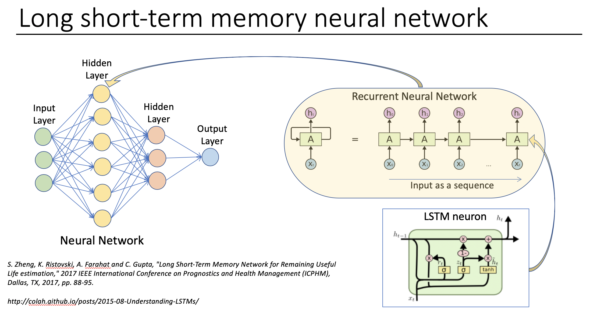
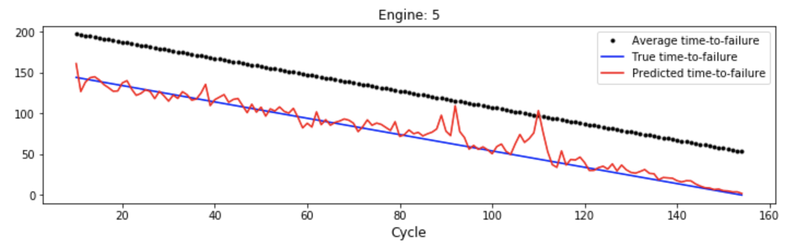

# Remaining Useful Life of a Machine



## Long Short-Term Memory Networks for Remaining Useful Life Estimation

Survival Analysis comprises of statistical approaches to analyze time to the underlying event of interest. The analysis may also be referred as reliability analysis. Here, we develop this package to understand the time series data of turbofan engines degradation simulations. The time series data contains hidden information that provides clues to the time to failure, also known as remaining useful life (RUL). Accurate estimation of RUL plays a critical role in health management of turbofan engines. This package preprocess and analyzes the data and develop a machine learning model to capture the hidden information such as interactions between multiple sensors measurements and degradation patterns. In this package, we propose Long Short-Term Memory (LSTM) approach for RUL estimation. LSTM models are based on neural network with cyclic connections that makes them powerful in modeling sequences and forecast the degradation patterns.


### Package Installation
```sh 
$ cd <Directory of your choice>
$ git clone  https://github.com/manngithub/RUL.git
$ cd RUL
$ conda env create -f SAPenv.yml
$ conda activate SAPenv
$ pip install .
```
Use the optional -e for a developer install


### Model - Long Short-Term Memory Network (LSTM)

LSTM is a type of recurrent neural network (RNN) for sequence learning tasks and has achieved great success on speech recognition and machine translation. An LSTM is well-suited to classify, process and predict time series given time lags of unknown size and duration between important events. LSTM does not have long-term time dependency problems by controlling information flow using input gate, forget gate and output gate. Remembering information for long periods of time is practically their default behavior. Due to inherent sequential nature of sensor data, LSTMs are well-suited for remaining useful life (RUL) estimation using sensor data. In this package, multilayer model of LSTM cells in combination with standard feedforward layers is developed for different training data settings. The model discovers the hidden patterns from sensor and operational data with different conditions.  _Reference 1_



### Data Description

NASA C-MAPSS (Commercial Modular Aero-Propulsion System Simulation) data set (Turbofan Engine Degradation Simulation Data Set) is a widely used benchmark data. C-MAPSS data includes sensor data with different number of operating conditions and fault conditions. The data has 4 sub-data sets with different number of operating conditions and fault conditions and each sub-data set is further divided into training and test subsets, as shown in table above. We use dataset FD002 for our purpose. Each row in the data is a snapshot of data taken during a single operating time cycle, which includes 26 columns:

* 1st column represents engine ID,
* 2nd column represents the current operational cycle number,
* 3-5 columns are the three operational settings that have a substantial effect on engine performance,
* 6-26 columns represent the 21 sensor values. More information about the 21 sensors can be found in _Reference 2_

The engine is operating normally at the start of each time series, and develops a fault at some point in time which is unknown. In the training set, the fault grows in magnitude until a system failure. In the test set, data is provided up to some time prior to system failure. The goal is to estimate the number of remaining operational cycles before failure on the test data. In this package we use only FD002 dataset for demonstrating capabilities of LSTM to estimate remaining useful life.

### Data Analysis and Results
There are separate notebooks that shows how to utilize different modules to analyze the data as well as develop and test a LSTM model to evaluate the remaining useful life of a engine. Check the Examples directory. A sample test of the saved model is shown here -


This shows the engine time to failure as well as the model predictions at different times.

### References

[1] S. Zheng, K. Ristovski, A. Farahat and C. Gupta, "Long Short-Term Memory Network for Remaining Useful Life estimation," 2017 IEEE International Conference on Prognostics and Health Management (ICPHM), Dallas, TX, 2017, pp. 88-95.

[2] E. Ramasso and A. Saxena, “Performance benchmarking and analysis of prognostic methods for cmapss datasets.” International Journal of Prognostics and Health Management, vol. 5, no. 2, pp. 1–15, 2014.
